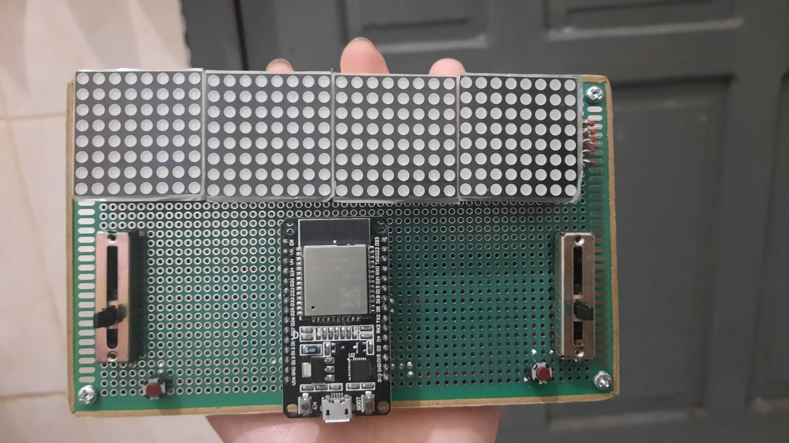
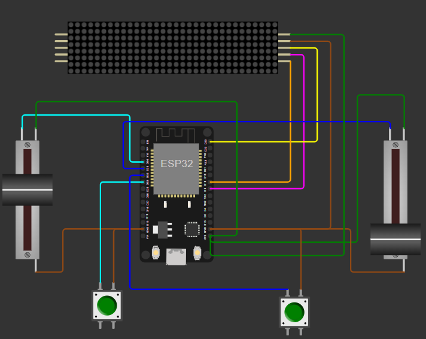

# 🏓 Game Ping Pong Interaktif pada Dot Matrix

Proyek Game Ping Pong Interaktif Ini adalah implementasi game arkade klasik yang sepenuhnya dibangun di atas perangkat keras fisik menggunakan mikrokontroler ESP32 dan layar LED Dot Matrix. Proyek ini dirancang untuk memberikan pengalaman bermain yang nyata dan interaktif, di mana pemain mengontrol *paddle* mereka secara langsung menggunakan potensiometer geser.
Proyek ini merupakan tantangan mandiri yang mencakup perancangan sirkuit elektronik, perakitan pada PCB, dan pengembangan *firmware* dari nol.

### 📸 Tampilan & Video Demo Perangkat

*Gambar: Tampilan atas perangkat yang telah dirakit pada PCB.*
**[Klik disini untuk melihat Video Demo Game Ping Pong Interaktif](https://drive.google.com/file/d/1Os3Al42TmW6Glg5GUIlgboR-caj-aXzD/view?usp=sharing)**

---

## ✨ Fitur & Aturan Main

Permainan ini dirancang dengan aturan yang sederhana namun menantang: 

* **Inisialisasi**: Saat dinyalakan, layar akan menampilkan *running text* nama dan NRP pembuat.
* **Mekanisme Dasar**: Permainan terdiri dari 2 *paddle* (raket) dan satu bola. 
* **Kontrol Real-time**: Setiap *paddle* digerakkan secara vertikal menggunakan potensiometer geser.
* **Sistem Skor**: Poin bertambah (+1) jika bola berhasil melewati *paddle* lawan. 
* **Pantulan Bola**: Bola akan memantul saat mengenai batas atas/bawah arena dan saat mengenai *paddle*. 
* **Fitur "Smash"**: Pemain dapat menekan tombol untuk "memukul" bola, yang akan meningkatkan kecepatan bola untuk sementara. 
* **Servis**: Setelah mencetak skor, pemain yang mendapatkan poin akan memulai giliran servis. 
* **Kondisi Menang**: Pemain pertama yang mencapai **5 poin** akan menjadi pemenang, dan layar akan menampilkan *running text* pengumuman kemenangan. 

---

## 🛠️ Teknologi & Komponen

Proyek ini dibangun menggunakan komponen hardware dan software berikut:

### Hardware
| Komponen | Jumlah | Deskripsi |
| :--- | :--- | :--- |
| **ESP32 Dev Kit** | 1 | Otak utama yang mengontrol seluruh logika permainan. |
| **Dot Matrix MAX7219** | 1 | Modul display $32 \times 8$ sebagai arena permainan. |
| **Potensiometer Geser** | 2 | Digunakan sebagai kontroler untuk menggerakkan *paddle*. |
| **Momentary Button** | 2 | Digunakan untuk fitur "Smash". |
| **PCB** | 1 | [cite_start]Papan sirkuit $9 \times 15$ untuk merakit semua komponen.  |

### Software & Firmware
| Kategori | Teknologi |
| :--- | :--- |
| **Bahasa** |  (Framework Arduino) |
| **Library Utama** | `MD_Parola.h`, `MD_MAX72xx.h`, `SPI.h` |
| **IDE** | `Arduino IDE` |

---

## 🔌 Skema Rangkaian

Berikut adalah simulasi skema rangkaian yang digunakan untuk menghubungkan semua komponen.

